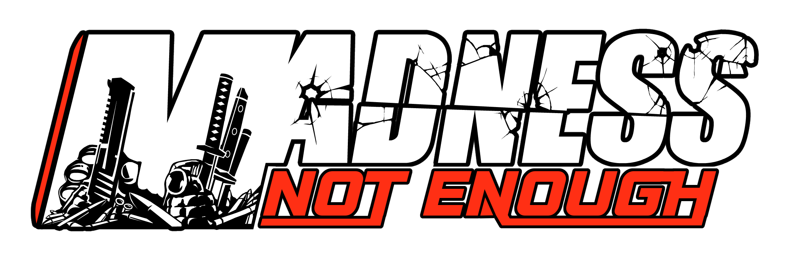

# NotEnoughMadness
NOTE: Not Enough Madness is currently in a WORK IN PROGRESS state. 
There is no releases and it is not ready for
normal user use. 

# Features
* Extended custom scenes support
* Ingame cheat menu
* Quality of life patches
* Highly customizable

# Build
Before building you will have to set the reference dll paths. They are not provided with the project. Also you will need 🔥🔥🔥 BEPINEX 🔥🔥🔥 installed for M:PN.