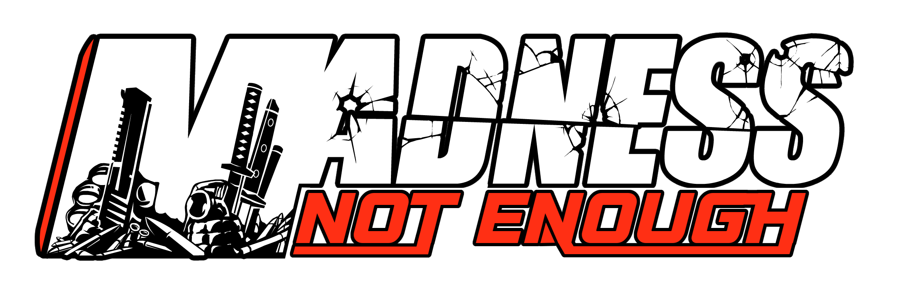
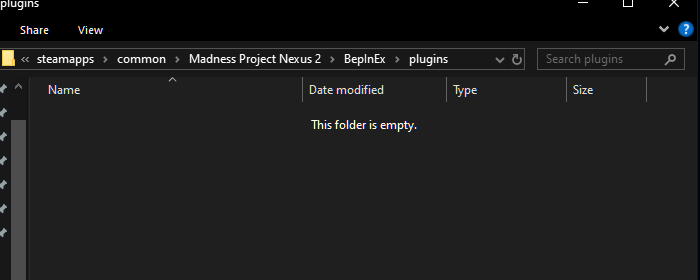

# NotEnoughMadness
NOTE: Not Enough Madness is currently in a WORK IN PROGRESS state. 
There is no releases and it is not ready for
normal user use. 



# Features
* Extended custom scenes support
* Ingame cheat menu
* Quality of life patches
* Highly customizable

# Installation
Navigate to your BepInEx plugins folder inside the Madness Project Nexus 2 install directory.
```
steam/steamapps/common/Madness Project Nexus 2/BepInEx/plugins
```

Drag and drop the NotEnoughMadness.dll in there.

You're done!

Visual showcase:<br/>


# Build
Before building you will have to set the reference dll paths. They are not provided with the project. Also you will need [🔥🔥🔥 BEPINEX 🔥🔥🔥](https://github.com/bepinex/bepinex/releases) installed for M:PN.